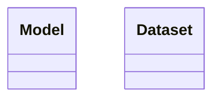

# mef
Model Evaluation Framework


This is a library/framework to be defined. It allows researchers to evaluate their models, using a statistical method. 


## Tutorial
Researchers must define models as pytorch classes





### Example of usage 

This is the Model Definition of two neural nets `NeuralNet` and `ConvNet`. 

```python
    class NeuralNet(torch.nn):
        def __init__(self):
            self.net = Sequential(
                Linear()
            )
        def forward(self,batch):
            return self.net(batch)

    class ConvNet(torch.nn):
        def __init__(self):
            self.net = Sequential(
                CNN()
            )
        def forward(self,batch):
            return self.net(batch)

```

Second step is having a Dataset class 
```python
    class Mnist(Dataset):
        def __init__(self):
        ...
```


Third step is implementing the abstract class Experiment.

```python
    class MyRun(Experiment):
        def __init__(self):        
```


Finally add the models to your experiment. 

```python
    
    models = {
        "ConvNet": ConvNet,
        "NeuralNet": NeuralNet
    }

    experiment = MyRun( models , dataset )
```

FactoryPattern